# CRUD API Pizzas — Flutter consumiendo un API REST propio

Aplicación Flutter que implementa un **CRUD (Crear, Leer, Actualizar, Eliminar)** consumiendo un **API REST propio** (Node.js + Express + PostgreSQL), en vez de una base de datos local. El API es [`api-pizzas-rest`](https://github.com/mauuu4/api-pizzas-rest), desplegado en Render: `https://api-pizzas-7v98.onrender.com`.

El modelo de datos es maestro-detalle, fiel al API:

- **Pizza** (maestro): nombre, origen, estado (activa/inactiva).
- **Ingrediente** (catálogo/detalle): nombre, calorías, estado. Cada pizza puede tener varios ingredientes con una **cantidad** asociada (relación muchos a muchos).

Al crear o editar una pizza, se seleccionan los ingredientes del catálogo (checkbox) y se define la cantidad de cada uno — igual que en `POST /pizzas` y `PUT /pizzas/:id` del API.

## ✅ Requisito cumplido

> "CRUD consumiendo una API" (en vez de una base de datos local)

- No usa ninguna base de datos local: todas las operaciones (`GET`, `POST`, `PUT`, `DELETE`) se hacen por HTTP contra el API real, usando el paquete [`http`](https://pub.dev/packages/http).
- CRUD completo para **dos** recursos del API:
  - [`lib/services/pizza_service.dart`](lib/services/pizza_service.dart) → `getPizzas`, `createPizza`, `updatePizza`, `deletePizza`
  - [`lib/services/ingredient_service.dart`](lib/services/ingredient_service.dart) → `getIngredients`, `createIngredient`, `updateIngredient`, `deleteIngredient`
- El cliente HTTP base con manejo de errores está en [`lib/services/api_client.dart`](lib/services/api_client.dart).

## Tecnologías

| Paquete | Uso |
|---|---|
| `http` | Cliente HTTP para consumir el API REST |
| API propio (`api-pizzas-rest`) | Backend Node.js/Express + Sequelize + PostgreSQL, desplegado en Render |

## Estructura del proyecto

```
lib/
├── main.dart                    # MaterialApp + navegación por pestañas (Pizzas / Ingredientes)
├── models/
│   ├── pizza.dart                # Modelo Pizza (maestro)
│   ├── ingredient.dart           # Modelo Ingrediente (catálogo)
│   └── pizza_ingredient.dart     # Relación pizza-ingrediente (con cantidad)
├── services/
│   ├── api_client.dart           # Cliente HTTP base (GET/POST/PUT/DELETE + manejo de errores)
│   ├── pizza_service.dart        # CRUD de Pizza contra el API
│   └── ingredient_service.dart   # CRUD de Ingrediente contra el API
└── pages/
    ├── pizza_list.dart           # Lista de pizzas con sus ingredientes (chips)
    ├── pizza_form.dart           # Crear/editar pizza + selección de ingredientes y cantidad
    ├── ingredient_list.dart      # Lista de ingredientes
    └── ingredient_form.dart      # Crear/editar ingrediente
```

## Endpoints del API consumidos

| Método | Endpoint | Uso en la app |
|---|---|---|
| `GET` | `/pizzas` | Listar pizzas con sus ingredientes anidados |
| `POST` | `/pizzas` | Crear pizza (con ingredientes y cantidades) |
| `PUT` | `/pizzas/:id` | Actualizar pizza y reemplazar sus ingredientes |
| `DELETE` | `/pizzas/:id` | Eliminar pizza (hard delete, cascada) |
| `GET` | `/ingredients` | Listar ingredientes del catálogo |
| `POST` | `/ingredients` | Crear ingrediente |
| `PUT` | `/ingredients/:id` | Actualizar ingrediente |
| `DELETE` | `/ingredients/:id` | Eliminar ingrediente |

Documentación completa de los endpoints en el propio proyecto del API: `API_DOCS.md`.

## Nota sobre CORS

El API originalmente no enviaba cabeceras CORS, lo cual bloqueaba las peticiones desde Flutter Web (no afecta a Android/iOS/Desktop, ya que CORS solo lo aplican los navegadores). Se agregó el middleware `cors` en `src/index.js` del proyecto del API y se desplegó el fix, para que la app funcione también desde la web.

## Cómo ejecutar

```bash
flutter pub get
flutter run
```

Elige el dispositivo (Chrome, Windows, Android, etc.). La app se conecta directamente a `https://api-pizzas-7v98.onrender.com` (configurable en [`lib/services/api_client.dart`](lib/services/api_client.dart:12)).

> Nota: al estar en el plan gratuito de Render, el API puede tardar unos segundos en "despertar" si estuvo inactiva.

## Capturas de pantalla

### Pizzas

#### 1. Lista de pizzas — operación READ
Pizzas obtenidas en tiempo real desde el API (`GET /pizzas`), con sus ingredientes mostrados como chips.


#### 2. Crear pizza — operación CREATE
Formulario con selección de ingredientes del catálogo y su cantidad.

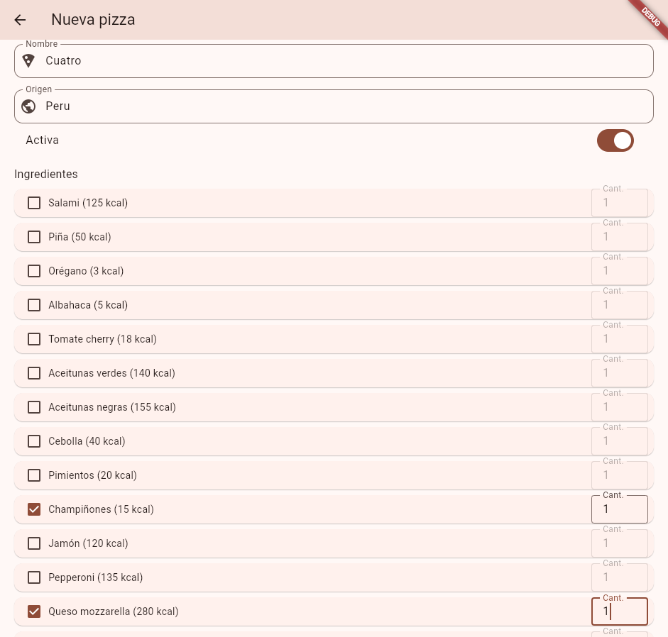

La pizza "Cuatro" creada exitosamente vía `POST /pizzas`:

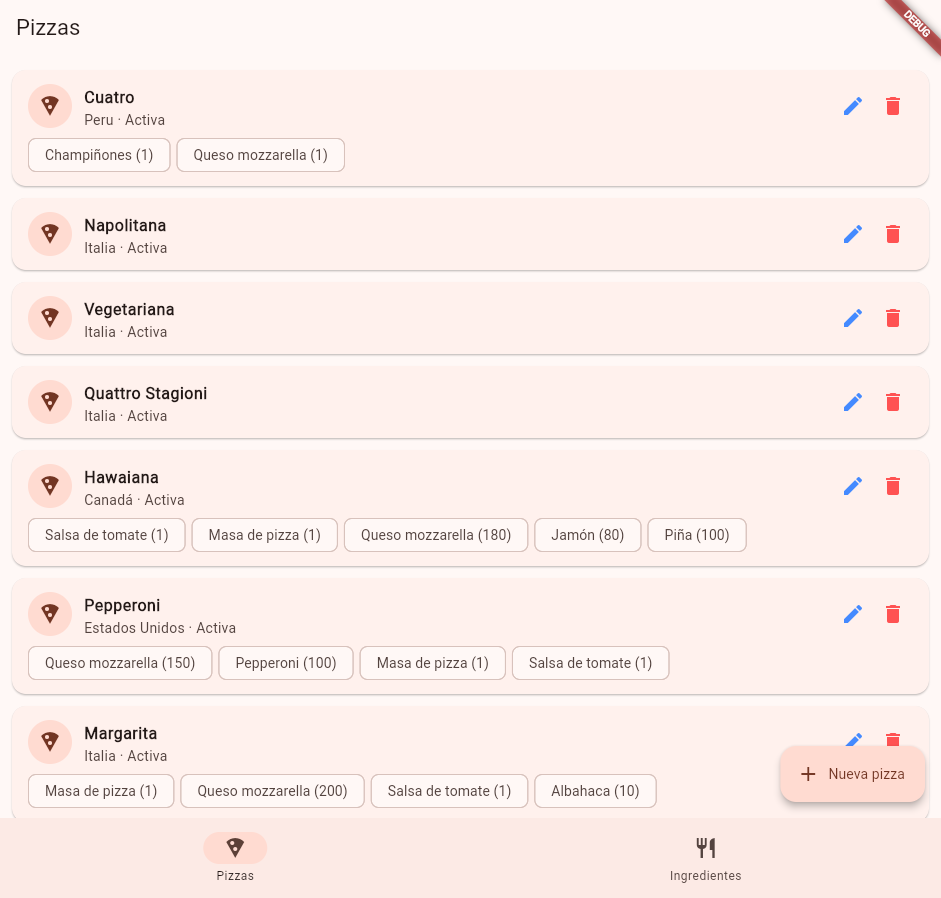

#### 3. Editar pizza — operación UPDATE
Formulario precargado con los ingredientes ya asociados a la pizza.

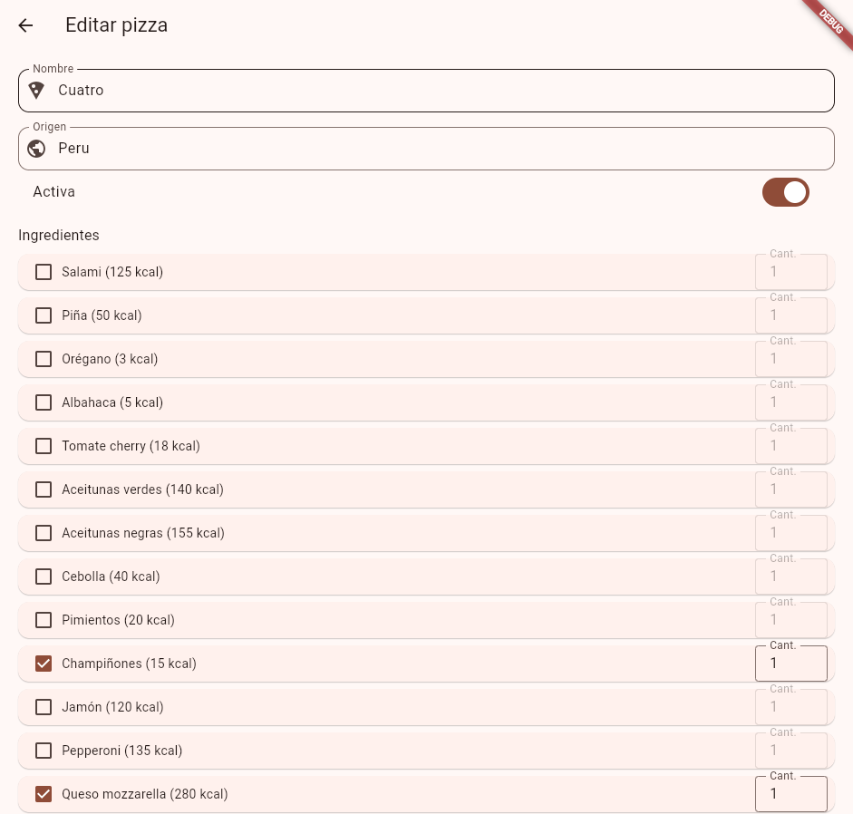

Cambios guardados vía `PUT /pizzas/:id` (se agregó el ingrediente Piña):

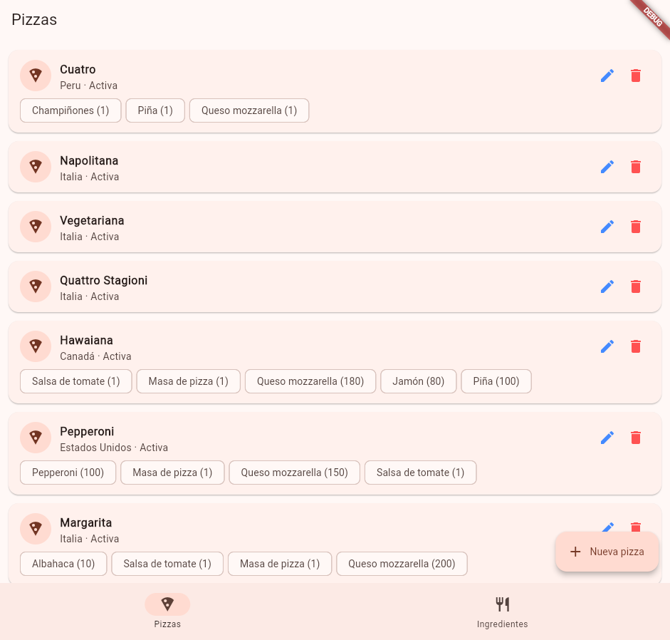

#### 4. Eliminar pizza — operación DELETE
Confirmación antes de eliminar:

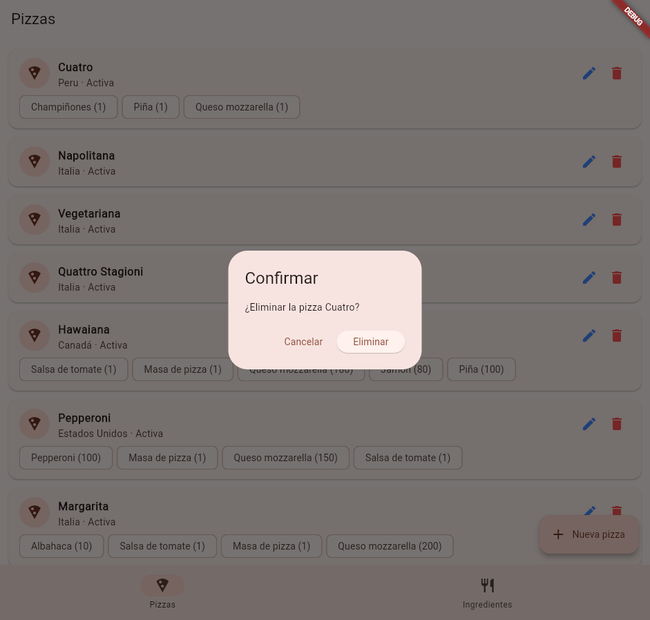

Pizza eliminada vía `DELETE /pizzas/:id`:

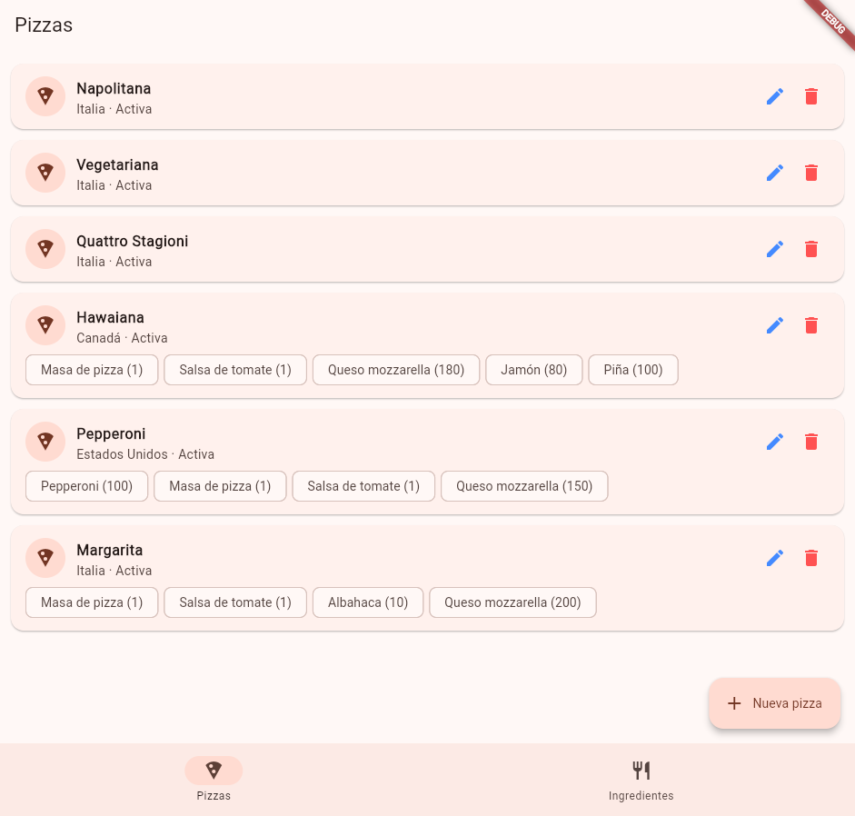

### Ingredientes

#### 5. Lista de ingredientes — operación READ
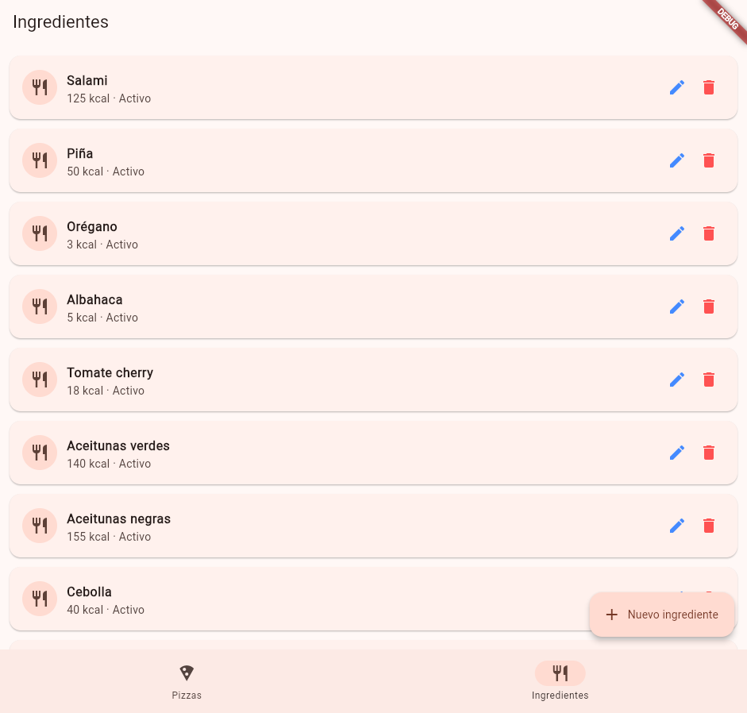

#### 6. Crear ingrediente — operación CREATE
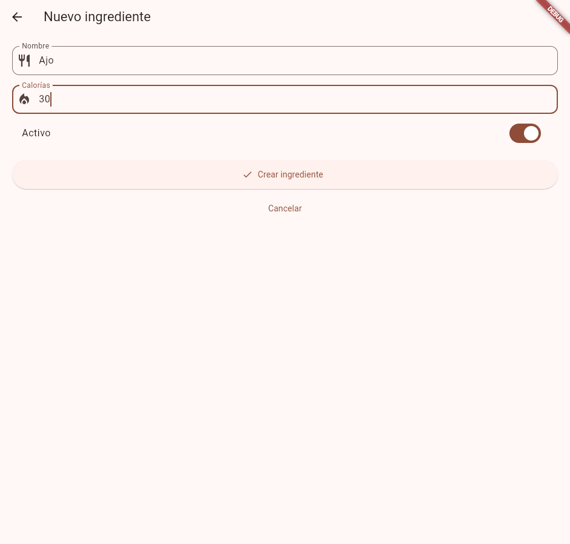
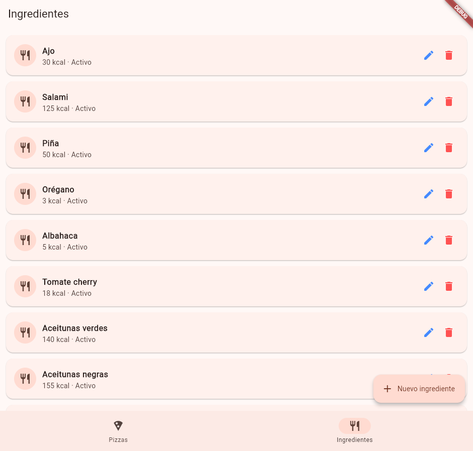

#### 7. Editar ingrediente — operación UPDATE
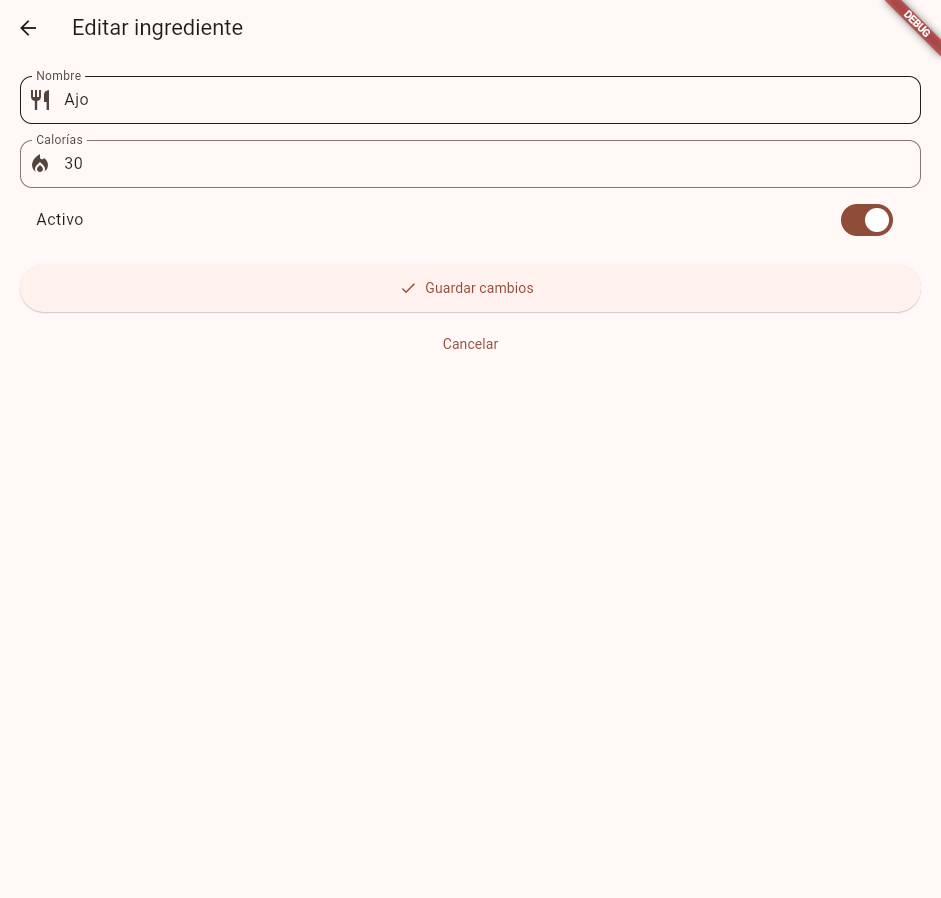
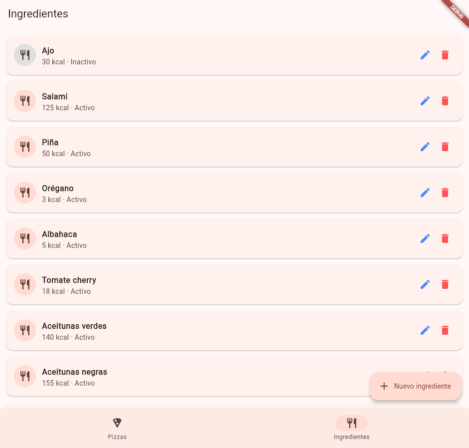

#### 8. Eliminar ingrediente — operación DELETE
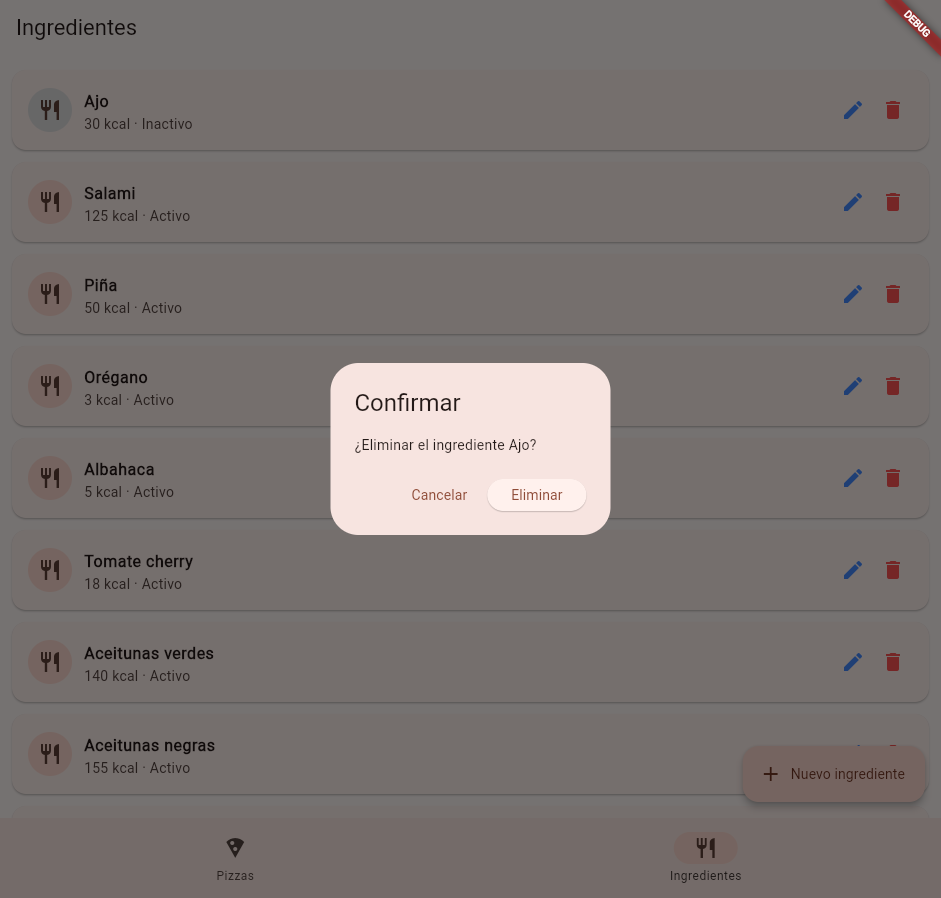
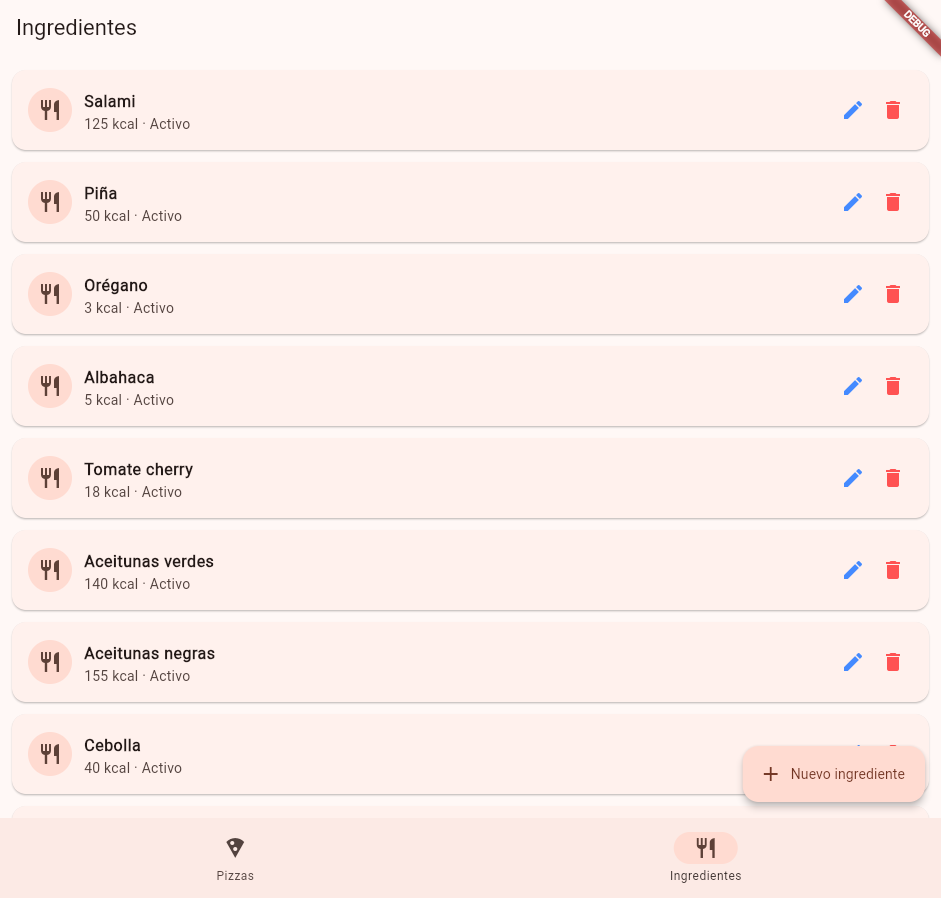
